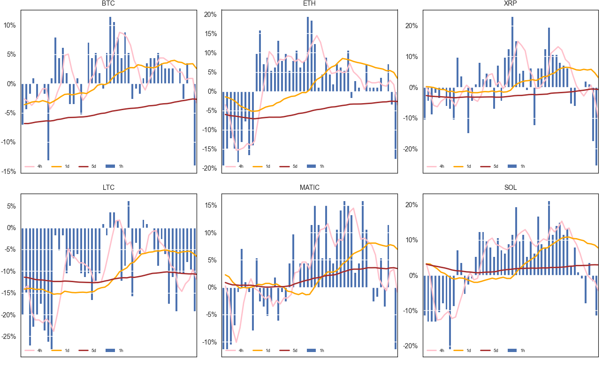

# crypto
## Funding Rates Plotting
* Create virtual env
* pip install -r requirements 
* Config in exchange_config.py
    * API credentials
    * list of currencies
 * python funding_rates_plot.py

